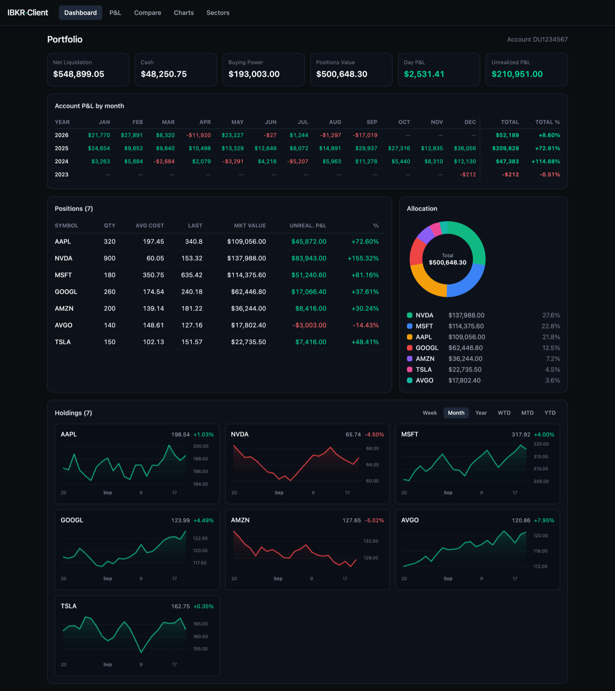
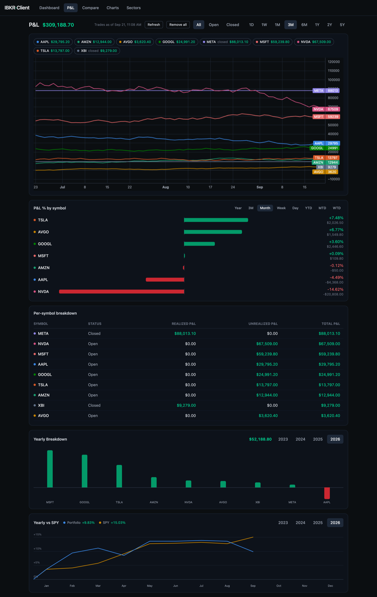
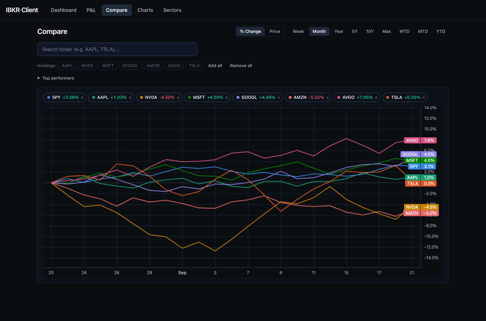
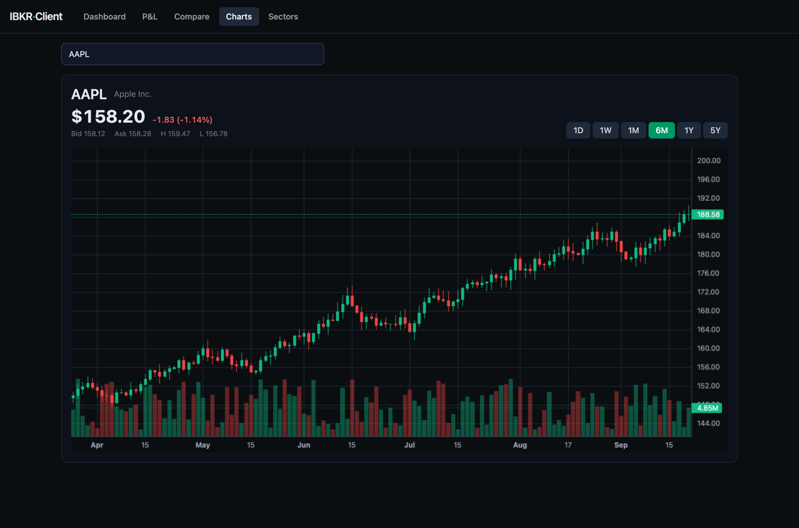
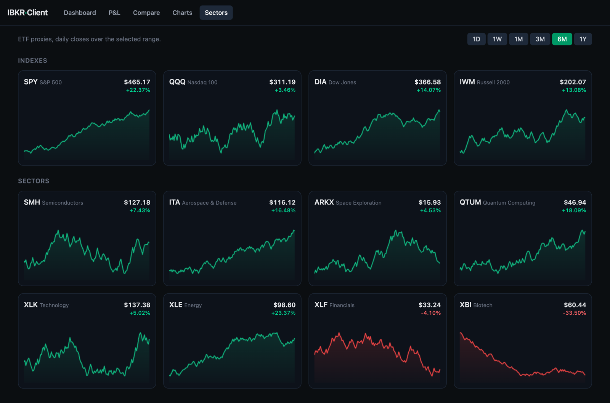

# IBKR Client

A local, read-only web client for viewing **charts/quotes** and **portfolio
insights** from your Interactive Brokers account — a friendlier face than the TWS
desktop UI.

- **Backend:** Node + TypeScript + Fastify, talking to IB Gateway/TWS via
  [`@stoqey/ib`](https://github.com/stoqey/ib) (`IBApiNext`).
- **Frontend:** React + Vite + Tailwind + TradingView
  [`lightweight-charts`](https://tradingview.github.io/lightweight-charts/) v5.
- **Scope:** read-only. No orders are ever placed (and the *Read-Only API* toggle
  below enforces it at the gateway).

```
IB Gateway (127.0.0.1:4001) ──socket──> Node/Fastify backend ──REST+WS──> React UI
```

Everything runs on your own machine. The app only ever talks to your local IB
Gateway/TWS and the IBKR Flex web service — no third-party servers, no telemetry.



> Screenshots throughout this README use **synthetic demo data** — not a real
> account.

---

## Prerequisites

- **Node.js ≥ 20** and **[pnpm](https://pnpm.io/)** (`npm install -g pnpm`).
- **An Interactive Brokers account.**
- **IB Gateway** (recommended) or **Trader Workstation (TWS)** installed and
  logged in. There is no gateway-less path for retail accounts — the backend
  connects to a locally running connector over a socket.
- *(Optional, for the full P&L tab)* **IBKR Flex Web Service** credentials, so
  the app can read your full trade history including closed positions. Without
  them the P&L tab still works but approximates from current positions only.

---

## 1. One-time IBKR setup

Install **IB Gateway** (the lightweight, headless choice, recommended over full
TWS), log into your **live** account, then:

**Configure → Settings → API → Settings**
- ✅ Enable ActiveX and Socket Clients
- Socket port = **4001** (live). Paper trading = 4002.
- Trusted IPs → add **127.0.0.1**
- ✅ **Read-Only API** (blocks any order — matches this app's scope)

> Prefer full TWS? It works unchanged — just set `IB_PORT=7496` (live) / `7497`
> (paper).

> **Market data:** realtime quotes require an active market-data subscription on
> the account. Without one, set `IB_MARKET_DATA_TYPE=3` to use IBKR's delayed
> feed — the UI clearly badges quotes/charts as **DELAYED**.

> IB Gateway auto-restarts daily; the backend reconnects automatically.

### (Optional) Flex Web Service for full trade history

The **P&L** tab is most useful with your complete realized-trade history. Enable
the Flex Web Service in **Client Portal → Performance & Reports → Flex Queries**:

1. **Activate** the Flex Web Service and copy the **token**.
2. Create a **Trade Confirmation / Activity Flex Query** that includes the
   **Trades** section (XML format). Note its **query id**.
3. IBKR caps each Flex query at a **365-day** window. To cover more history,
   create one query per year range and pass their ids as a comma-separated list
   in `IB_FLEX_QUERY_ID`.

Then set `IB_FLEX_TOKEN` and `IB_FLEX_QUERY_ID` (see [Configuration](#3-configuration-env-vars)).
The server fetches and caches trades in a local SQLite file and refreshes them
periodically.

**Backfilling beyond the Flex service's reach:** the web service only reaches
365 days back, but in Client Portal you can *run* the same query over a custom
date range to inception (≤365 days per run) and download each period as XML.
Import those files once:

```bash
pnpm --filter server import:flex ~/Downloads/2021.xml ~/Downloads/2022.xml …
```

Imports dedup on trade id, so re-running is safe, and the running server picks
up new trades within ~60s (no restart needed).

---

## 2. Install & run

```bash
pnpm install

# Dev (two processes, hot reload):
pnpm dev              # runs server + web together (IB_PORT default, 4001 live)
pnpm dev:paper        # same, but against paper IB Gateway (IB_PORT=4002)
pnpm dev:tws          # same, but against live TWS (IB_PORT=7496; use 7497 paper)
# …or individually:
pnpm dev:server       # backend on http://127.0.0.1:4010
pnpm dev:web          # UI on http://127.0.0.1:5173  (proxies /api + /ws to backend)

# …or production single-origin:
pnpm build
pnpm start            # serves API + built UI on http://127.0.0.1:4010
```

Open **http://127.0.0.1:5173** (dev) or **http://127.0.0.1:4010** (prod).

---

## 3. Configuration (env vars)

Every variable has a sensible default, so a stock local IB Gateway setup needs
**none** of them — create `server/.env` (git-ignored) only to override. The
**Required?** column flags the cases where you *would* need to set one.

| Var | Required? | Default | Meaning |
|-----|-----------|---------|---------|
| `PORT` | Optional | `4010` | Backend HTTP/WS port |
| `IB_HOST` | Optional | `127.0.0.1` | Gateway/TWS host |
| `IB_PORT` | **Set for TWS / paper** | `4001` | 4001/4002 (Gateway live/paper), 7496/7497 (TWS live/paper) |
| `IB_CLIENT_ID` | Optional | `10` | API client id |
| `IB_MARKET_DATA_TYPE` | **Set to `3` if no realtime sub** | `1` | 1=realtime, 3=delayed, 2/4=frozen variants |
| `IB_RECONNECT_MS` | Optional | `5000` | Auto-reconnect interval |
| `IB_FLEX_TOKEN` | **Required for full P&L history** | *(empty)* | Flex Web Service token |
| `IB_FLEX_QUERY_ID` | **Required for full P&L history** | *(empty)* | Flex query id(s); comma-separated for multiple year ranges |
| `IB_FLEX_REFRESH_HOURS` | Optional | `12` | Hours stored trades stay fresh before re-fetch |
| `DB_DRIVER` | Optional | `sqlite` | Storage driver (only `sqlite` today) |
| `DB_SQLITE_PATH` | Optional | `server/.data/ibkr.sqlite` | SQLite file location |

> `IB_FLEX_TOKEN` and `IB_FLEX_QUERY_ID` are required **together** — set both to
> enable the P&L tab's full trade history, or neither to fall back to a
> positions-only approximation.

---

## 4. The UI — tabs & views

The app is a single dark dashboard with five tabs (top nav). Prices/charts badge
as **DELAYED** when the account lacks a realtime subscription.

### Dashboard (`/`)

*(pictured at the top of this README)*

A live snapshot of the account, polling every 10 seconds.
- **Summary cards:** Net Liquidation, Cash, Buying Power, Positions Value, Day
  P&L, Unrealized P&L.
- **Account P&L by month:** a year × month grid of the whole account's P&L.
- **Positions table:** each holding with quantity, average cost, last price,
  market value, unrealized P&L, and % return.
- **Allocation:** a breakdown of portfolio weight by holding.
- **Per-holding charts:** a small price chart per position, with
  Day / Week / Month / Year / WTD / MTD / YTD timeframes. **Day** shows live
  intraday movement (5-min bars, auto-refreshed). Each card has a 🔍 magnifier
  that opens that symbol in the **Charts** tab.

### P&L (`/pnl`)



Realized **and** unrealized P&L over time, built from your full trade history
(best with Flex configured — see above).
- **Header:** total P&L for the visible selection, a *Trades as of* timestamp,
  and a **Refresh** button to force a Flex re-fetch. Background refreshes show a
  ribbon and keep the last computed results on screen.
- **Filters:** **All / Open / Closed** position status, plus a range selector
  (**1D → 5Y**). Clicking a legend chip toggles a symbol; *Remove all / Add all*
  toggles the whole set.
- **Cumulative P&L chart:** one line per symbol over the selected range.
- **P&L % by symbol:** percentage return per symbol across timeframes.
- **Per-symbol breakdown:** a table of realized / unrealized / total P&L.
- **Yearly Breakdown:** diverging bars of P&L per year.
- **Yearly vs SPY:** the portfolio's yearly return compared against SPY, matched
  like-for-like over the months the account was active.

> **What these numbers are.** Every figure on this tab (and in *Account P&L by
> month* on the Dashboard) is derived purely from your **trades** — FIFO-replayed
> against daily closes. Dividends, credit interest, fees, withholding tax and FX
> moves on non-USD cash are **not** included, because a trades-only Flex Query
> doesn't report them. The **Total %** column divides the year's P&L by the gross
> *position* value at the prior year-end — not by net liquidation value, and not
> time-weighted. TWS's "Total return this year" is a time-weighted return on NAV
> that neutralises deposits and withdrawals, so the two will not agree — expect a
> gap whenever the account earns income or is funded mid-year.

### Compare (`/compare`)



Overlay multiple symbols on one chart over a shared timeframe.
- **Modes:** **% Change** (rebased to the window start) or raw **Price**.
- **Timeframes:** Week / Month / Year / 5Y / 10Y / Max, plus WTD / MTD / YTD.
- **Adding symbols:** search any ticker, one-click **Holdings** chips to add your
  positions, or expand **Top performers** to rank a curated cross-asset universe
  (broad-market/sector ETFs, megacap tech, large caps, commodities/crypto/bonds)
  over the selected window.
- **Legend:** click a chip to hide/show a series, `×` to remove it.

### Charts (`/chart`)



A single-symbol candlestick chart with a live quote header.
- **Search** any ticker to load it.
- **Quote header:** last price, change and % change, bid / ask / high / low, and
  a **DELAYED** badge when applicable.
- **Timeframe presets:** 1D / 1W / 1M / 6M / 1Y / 5Y / 10Y (bar size scales with
  the range).
- **Recently viewed:** a strip of the last 10 inspected symbols (newest first)
  as compact sparklines below the main chart — click one to reopen it.

### Sectors (`/sectors`)



A grid of ETF-proxy mini-charts for a quick market read.
- **Indexes:** SPY, QQQ, DIA, IWM.
- **Sectors:** semiconductors, aerospace & defense, space, quantum, technology,
  energy, financials, biotech.
- Each card shows last price and % change over the selected range
  (**1D → 1Y**), tinted green/red by direction.

---

## 5. API surface

- `GET /api/health` — connection + market-data-type status
- `GET /api/search?q=AAPL` — symbol lookup
- `GET /api/symbol-info?symbol=AAPL` — contract details for a symbol/conId
- `GET /api/history?symbol=AAPL&barSize=1%20day&duration=6%20M` — candlestick bars
- `GET /api/portfolio` — positions, balances, PnL
- `GET /api/pnl?days=90` — realized/unrealized P&L series per symbol
- `POST /api/pnl/refresh` — force a Flex trade re-fetch
- `WS  /ws/quotes` — send `{"type":"subscribe","symbol":"AAPL"}`; receive `{type:"quote",…}`

---

## 6. Verify end-to-end

With IB Gateway running + logged in:

```bash
curl localhost:4010/api/health                    # connected:true, marketDataType
curl "localhost:4010/api/search?q=AAPL"           # matching contracts
curl "localhost:4010/api/history?symbol=AAPL&barSize=1%20day&duration=6%20M"
curl localhost:4010/api/portfolio                 # your positions/balances
```

Then in the browser: search **AAPL** on the **Charts** tab → candlestick chart +
live/DELAYED quote header; open **Dashboard** → positions, balances, P&L,
allocation (cross-check against TWS).

---

## Project layout

```
server/   Fastify backend — IB connection, market data, portfolio, P&L, Flex import
web/      React + Vite frontend — one page component per tab under src/pages
```

## Contributing

Issues and PRs welcome. Please keep the read-only scope intact — this app must
never place orders.

**Docs stay in lockstep with the UI:** any change to a tab, view, or user-facing
control must update this README in the same change (see `AGENTS.md` /
`CLAUDE.md`).
